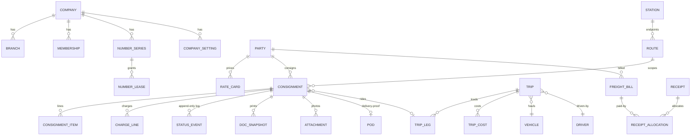
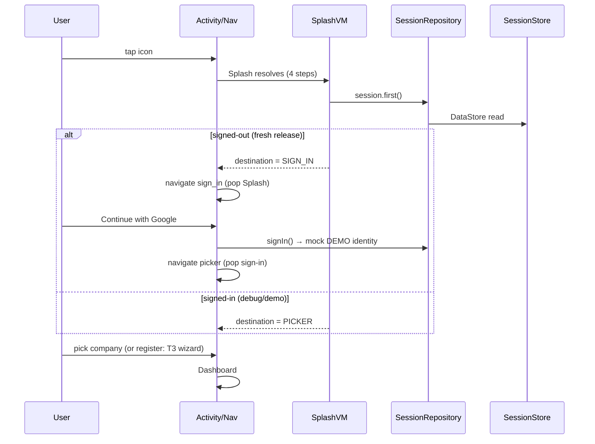
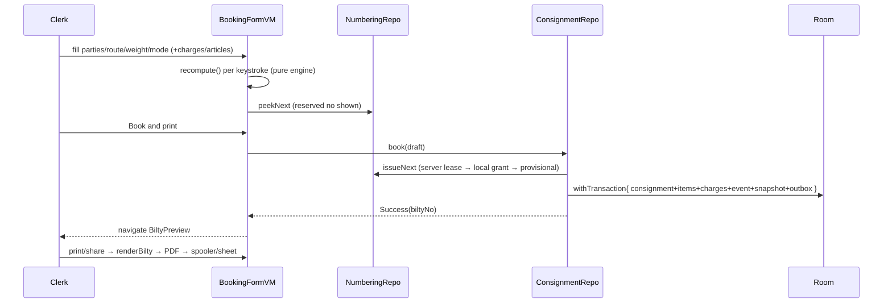
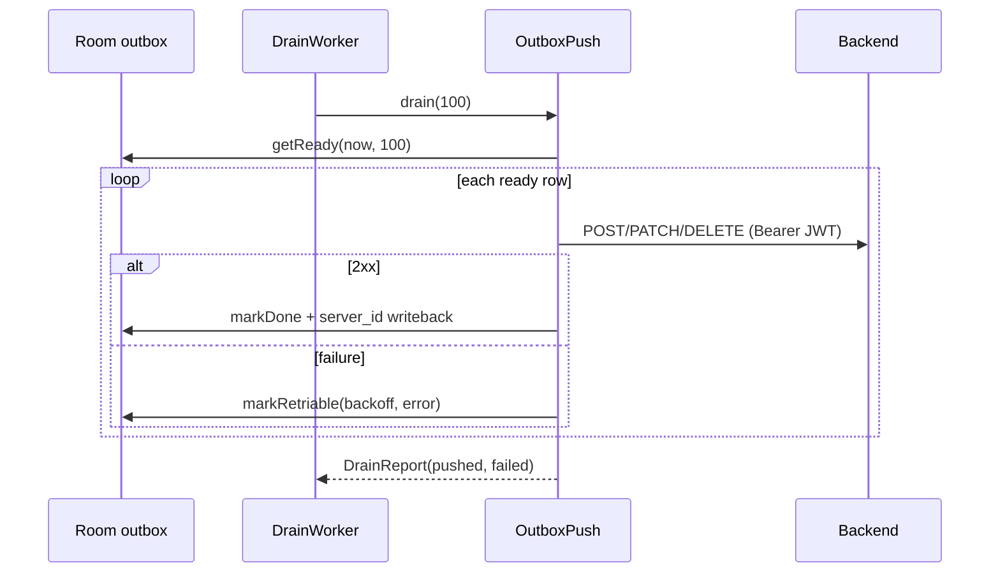

# Part 3 — Logic Layers: ViewModels, Repositories, Database, Network, Domain, DI, Navigation, State

## 8. ViewModel Documentation (30 ViewModels)

Shared grammar (Spec §3): `@HiltViewModel class XxxViewModel @Inject constructor(...)` with
`private val _uiState = MutableStateFlow(XxxUiState())` + `val uiState: StateFlow<...> =
asStateFlow()`; events via one `onEvent(sealed)`; one-shot effects as `MutableStateFlow`
flags (`signedIn`, `bookedBiltyNo`, `createdChallanNo`, `signedOut`) consumed by
`LaunchedEffect` in the screen; **no Compose imports, no Date()/RNG/File I/O** — clock
values enter as parameters or are formatted for display only.

| ViewModel | Route | Injected | State/events (deltas beyond the grammar) | Notes |
|---|---|---|---|---|
| `SplashViewModel` | T0 | SessionRepository | `SplashUiState(phase, stepName, stepIndex, destination)` | S18 fix: per-step update must `copy` (the replace bug sent signed-out users to T2). Steps: read session → memberships → company → open |
| `SignInViewModel` | T1 | SessionRepository | loading, `signedIn` one-shot | ContinueWithGoogle → `signIn()` (mock). Real email/password path: `signInWithPassword` exists at repo level; UI entry deferred |
| `CompanyPickerViewModel` | T2 | CompanyRepository, SessionRepository, **MastersRefresher** | companies/invitations rows; Select/Open/Accept/Decline/SignOut events; fires `mastersRefresher.refreshAll()` on init (S24) | Open → `selectCompanyAndBranch` → dashboard |
| `SetupWizardViewModel` | T3 | CompanyRepository, SessionRepository, NumberingRepository | step, 13 `SetupField` drafts, `justFinished`, error | Finish = registerCompany (one tx + outbox prereqs) + ensureSeries(BILTY) |
| `DashboardViewModel` | T4 | Session, Status, Dashboard repos | `DashTile`s role-gated, exceptions w/ biltyNo, `isEmpty`, hero figures, refresh event | tiles hidden (not greyed) per §13 |
| `BookingFormViewModel` | T5 | SavedStateHandle, Session, RateCardRepository, NumberingRepository, ConsignmentRepository, MastersRepository | largest VM (540 lines): parties, scope (routeId/goodsId), charges (auto + removed + manual S21), weight/dims (SavedStateHandle write-through), multi-article rows (persisted), payment/risk/delivery (persisted), amend prefill+reason, reserved number peek, `bookedBiltyNo` one-shot, `isExporting`-style feedback for charges dialog | `recompute()` per keystroke through the pure engine |
| `BiltyPreviewViewModel` (in BiltyPreviewUiState.kt) | T6 | SavedStateHandle(biltyNo), DocumentRepository | paper data, copy index, printStatus | render = pinned template version |
| `RegisterViewModel` | T7 | Session, RegisterRepository, **ReportsRepository** (export) | Paging3 items, chips, search debounce, summary, company identity for drawer, `isExporting/exportNote` | filter → summary → register all share one filter state |
| `CaseFileViewModel` | T8 | SavedStateHandle(biltyNo), Session, CaseFileRepository, ConsignmentRepository, StatusRepository, DocumentRepository | stats, timeline, documents, money, canManage, printStatus | printBilty/shareBilty (S21) → render snapshot → print/share; cancel (Manager) |
| `StatusUpdateSheetViewModel` | T9 | SavedStateHandle(biltyNo), Session, StatusRepository, PhotoImporter, appContext | legal options, hold reason/remark, consignee, signature/photo flags | DELIVERED gate: POD or Manager waiver (§7.1) |
| `ChallanBuilderViewModel` | T10 | SavedStateHandle, Session, TripRepository, NumberingRepository | pool, selection, load meter/overload, vehicle/driver, reserved challan no, `createdChallanNo` one-shot | selection survives process death (S19) |
| `ChallanDetailViewModel` | T11 | SavedStateHandle(challanNo), Session, TripRepository, **DocumentRepository** | money card (freight/hire/costs/margin), cost dialog draft, printStatus | Print/Share → renderChallan (S22); SaveCost → addCost |
| `VehicleBoardViewModel` | T12 | Session, TripRepository | board rows, filter, drawer identity | observeBoard Flow |
| `UnbilledPoolViewModel` | T13 | BillingRepository | party groups, filters (quarter/branch/age), selection totals, `onBillBuilt` one-shot | Build the bill → T14 |
| `FreightBillViewModel` | T14 | SavedStateHandle(billId), BillingRepository, **DocumentRepository** | stage machine (DRAFT/PREVIEW/ISSUED), rows, issue error, printStatus | Issue → issueBill (server assigns number) |
| `PaymentsViewModel` | T15 | BillingRepository | tab, ToPay rows (+Collect sheet incl. Manager waiver), receipts + Allocation sheet | allocation ≤ receipt ≤ outstanding |
| `StatementViewModel` | T16 | SavedStateHandle(partyId), BillingRepository, **DocumentRepository** | period FY, ledger rows, opening/closing, printStatus | SendPdf → renderStatement → share (S22) |
| `MastersHubViewModel` | T17 | MastersRepository | counts per family | |
| `MasterListViewModel` | T18 | MastersRepository | query, chips, duplicate pair, MergeDuplicates → mergeParties | |
| `MasterEditorViewModel` | T19 | SavedStateHandle(type,id), MastersRepository, Session | 11 field drafts (SavedStateHandle write-through, S19), save/delete, MASTER_IN_USE copy | draft clears on commit |
| `RateCardEditorViewModel` | T20 | SavedStateHandle(partyIdOrName), MastersRepository, Session | resolution steps, rate rows (paged view), auto charges, add-rate dialog (`_newRate`), save rows | ConfirmAddRate → addRateRow |
| `ReportsHubViewModel` | T21 | ReportsRepository | period, grouped entries | |
| `ReportViewerViewModel` | T22 | SavedStateHandle(reportId), ReportsRepository | register rows + totals | |
| `ExportCentreViewModel` | T23 | ReportsRepository | sheet picker w/ counts, format notice (XLSX/Tally → offline copy), build pack, `requestRegisterCsv` (S21), recent exports | |
| `SettingsHubViewModel` | T24 | SettingsRepository, SessionRepository, **MastersRefresher** | identity, counts, groups | rows route via nav callback |
| `CompanyProfileViewModel` | T25 | SavedStateHandle, SettingsRepository, SessionRepository, PhotoImporter | 15 draft fields (write-through, cleared on save), logo picker result (D60), save → saveCompanyProfile | |
| `BranchesViewModel` | T26 | SettingsRepository, SessionRepository | branches, add-branch dialog (name/code/address), canManage | SaveBranch → addBranch (D64) |
| `MembersViewModel` | T27 | SettingsRepository, SessionRepository | members (active/invited), invite dialog (email + role), cancel invite | invite/cancel are Owner-gated repo calls |
| `NumberingViewModel` | T28 | SettingsRepository, SessionRepository | series rows + counter-edit dialog (typed, forward-only) | changeSeriesCounter (D64: audit outbox) |
| `TemplatesViewModel` | T29 | TemplateRepository | filter, installed templates | |
| `TemplateRequestsViewModel` | T30 | — | static queued UI | §15 online |
| `AccountDataViewModel` | T31 | AccountDataRepository, SessionRepository, **OutboxPush**, **MastersRefresher** | storage facts, queue sentences, Try-now → drain + refresh (S25) | |
| `ProfileViewModel` | T33 | SessionRepository | identity, Save → updateDisplayName (S21), sign-out | |
| `AppNavDrawer`-fed identity | — | each root VM exposes companyInitials/companyName/branchName | | |

## 9. Repository Layer (17 repositories)

Grammar (Spec §6): constructor-injected DAOs + OutboxWriter + dispatchers via Hilt; reads
return `Flow`/suspend; writes `suspend fun x(): Result<T>` with
`database.withTransaction { entity upsert + outboxWriter.enqueue }`; validation (state
machine / calc / numbering) **before** any write; entities never leave the layer
(mappers/extension functions co-located).

| Repository | Aggregate | Key methods (→ effects) |
|---|---|---|
| `SessionRepository(Impl)` | identity/JWT (DataStore) | session Flow, signIn (mock), **signInWithPassword** (S23: AuthApi.login → store.signIn + saveToken; OFFLINE → degrade to DEMO), signOut (clear → SIGNED_OUT flag), updateDisplayName |
| `CompanyRepository(Impl)` | COMPANY/BRANCH/MEMBERSHIP | registerCompany (3 rows + prereq outbox + setActiveContext), selectCompanyAndBranch, invitations accept/decline, observeCompanies/Branches/MemberCounts/MembershipsForUser |
| `MastersRepository(Impl)` | 9 masters + rate cards | counts, observeParties (FTS), searchPartiesOnce (LIKE ≤120ms budget), createOrUpdateParty (PENDING+outbox), deleteParty (tombstone), **mergeParties** (re-point, tombstone, count absorb), rateRowsForParty, saveRateRow, **addRateRow** (S21), autoCharges, resolveParty/partyDetail |
| `RateCardRepository(Impl)` | rate resolution | routeOptions/goodsOptions/partyOptions (SettingsDao joins), **resolveBookingRate** (5-step cascade), autoApplyHeads, bookingSettings (dated §10.5) |
| `ConsignmentRepository(Impl)` | CONSIGNMENT aggregate | **book/amend** (number lease → snapshot → event → items/charge lines → outbox, one tx), cancel (Manager gate, number retained), loadForAmendment, snapshotByBiltyNo |
| `RegisterRepository(Impl)` | register reads | pagingRegister (PagingSource w/ filters), summary |
| `CaseFileRepository(Impl)` | case-file projection | caseFile(...) → header/stats/timeline/documents/money/record lines |
| `StatusRepository(Impl)` | STATUS_EVENT + POD + projection | append (state-machine gate, projection advance, outbox), bulkAppendByChallan, recordPod, waiveTopPay, exceptions, countOverdue, rebuildProjection, **addAttachment** (S19 PhotoImporter → file → ATTACHMENT_E + outbox), legalNext/currentStatus |
| `NumberingRepository(Impl)` | NUMBER_SERIES/LEASE | peekNext, **issueNext** (S24: server lease → local grant → provisional), debug shrink/grants, ensureSeries (S18) |
| `TripRepository(Impl)` | TRIP aggregate | createTrip+issue, dispatch, close (bulk events), observeBoard, tripDetail, **addCost** (remark mandatory) |
| `BillingRepository(Impl)` | BILLING aggregate | unbilledPool, buildBill, observeBill, removeConsignmentFromDraft, issueBill, recordReceipt, allocateReceipt, statement, getReceiptsForParty |
| `DashboardRepository(Impl)` | read-only tiles | load(now, companyWideToday) — 10 parallel queries |
| `DocumentRepository(Impl)` | documents | renderBilty (pinned template), renderChallan/renderFreightBill/renderReceipt/renderStatement (S22 inline HTML), share/print/saveToDownloads via PdfPort/PdfActions, copyLabels |
| `TemplateRepository(Impl)` | TEMPLATE_E | observeTemplates, getActiveTemplate, getTemplateVersion, installTemplate |
| `ReportsRepository(Impl)` | read-only + exports | freightRegister(+CSV), buildCsvExport/buildCsvPack, recentExports, registerCsvForPeriod, sheetCounts |
| `SettingsRepository` | settings + org writes | companyProfile/saveCompanyProfile (+outbox), branches(), series(), **changeSeriesCounter** (S19, forward-only), **addBranch** (S21), **inviteMember/cancelInvitation/cancelInvitationByMail** (S19/S21), **saveLogo** (S22 → PhotoImporter → logo_ref + outbox) |
| `AccountDataRepository` | T31 facts | phoneData (records, bytes, queue) |
| `MastersRefresher` (S24) | remote→Room | refreshAll/Parties/Stations — upsert by server_id (D63) |
| `OutboxPush` (S25) | outbox→REST | drain(limit) → DrainReport(pushed, failed) (D64) |

## 10. Database Layer

- **Room v12**, database `transport.db`, one `@Database` class with 13 DAO accessors.
- **33 entities + 2 FTS4** (+outbox, outbox_prereq, sync_cursor, seed_version) — full
  column lists in Part 2 §3.3; ERD in `TransportApp/Project_Analysis_2.md` §7.3 (verified).
- **Migrations:** `MIGRATION_1_2 … MIGRATION_11_12` (10→11 amendment_reason; 11→12
  logo_ref) — each with a Robolectric `MigrationXtoYTest` (the fresh-run "cannot find the
  schema file" failure is expected once; KSP regenerates then it passes).
- **Indices:** name/company/branch/status/email/party/route/series as declared per entity;
  FTS4 on PARTY and CONSIGNMENT (search uses LIKE — D7 benchmark).
- **TypeConverters:** the four enums ↔ String.
- **Transactions:** every write is `withTransaction { entity + outbox (+prereqs) }`.
- **Seeding:** `DemoSeeder` (seed_version gate) — 3 companies, 1,284 parties, series +
  50-number BILTY lease, bilties incl. held/overdue examples, challan, issued bill,
  receipts, templates, rate cards, settings. **Debug-only (A1 gate).**

## 11. Network Layer

- **No Retrofit/Ktor.** `:core:network` wraps **OkHttp 4.12** in `ApiClient` — the single
  boundary (Spec §14). Methods: `get/post/put/patch/delete` → `Result<JsonObject>`,
  `*Raw` → `Result<String>`, `*Json(builder)` helpers.
- **Auth interceptor** reads `TokenProvider` (SessionStore.token()) per call and attaches
  `Authorization: Bearer …` when present.
- **Error mapping** (call boundary): 401→AUTH_EXPIRED, 403→AUTH_NO_ACCESS,
  404→MASTER_IN_USE, 409→DUP_CLIENT_OP, other codes→OFFLINE_UNAVAILABLE (message =
  backend `error` field), IOException→OFFLINE_UNAVAILABLE (`OFFLINE_MESSAGE`). **The
  boundary catches every Exception** — malformed URL on a misconfigured backend is still
  an offline state, not a crash.
- **Serialization:** kotlinx-serialization with `ignoreUnknownKeys` (D47 amendment:
  allowed in `:doc-engine` **and** `:core:network`).
- **DTOs:** none formal — `JsonObject` + per-API parsers (`AuthApi.toAuth()`,
  `MastersApi.toList()`), returning domain-facing value types (`AuthResponse`,
  `RemoteMaster`).
- **Timeouts/retry:** OkHttp defaults; retry policy lives in the outbox (exponential
  backoff per row), not the client. No HTTP cache (Room is the cache).
- **Base URL:** `http://10.0.2.2:3000/` (emulator → host loopback) in `NetworkModule`;
  release `network_security_config` is HTTPS-only — production deployment flips this.

## 12. Domain Layer

- `ConsignmentStateMachine` — transition table (see Part 2 §3.2 excerpt); callers gate
  appends; allowed(from) drives T9's legal options.
- `TripStateMachine` — OPEN→ISSUED→DISPATCHED→CLOSED (+CANCELLED before dispatch).
- `ChargeCalculator.calculate(CalculationInput) → charges/taxable/gst/total` — exact paise;
  supports `ManualCharge` lines (S21), removed heads, volumetric, GST treatments.
- `RateResolver` + `MinQty` — 5-step cascade, exact integer parsing (S18), min-qty floors.
- `ChargeableWeight` — max(actual, volumetric ceil) with weight-step rounding.
- `RoleRank.atLeast` — role gates; `Ageing` — overdue buckets/grace.
- `Money`/`Weight` — paise/grams; `formatIndianGrouping`.
- **UseCases:** none — repositories hold the business logic (deliberate; Spec §6).

## 13. Dependency Injection

- Hilt everywhere: `@HiltAndroidApp` (TransportApp), `@AndroidEntryPoint` (MainActivity),
  `@HiltViewModel` (30 VMs), `@HiltWorker` (OutboxDrainWorker).
- `DataModule` (@Binds ×18): repo interfaces → impls.
- `DatabaseModule`: DB + all 13 DAOs (@Singleton).
- `NetworkModule` (S23): TokenProvider ← SessionStore.token(), ApiClient (base URL
  10.0.2.2:3000), AuthApi, NumberingApi, MastersApi.
- `DeviceModule`: DeviceIdProvider (ANDROID_ID short id for leases).
- `DispatcherModule` + `Qualifiers`: @IoDispatcher.
- Scopes: @Singleton for repos/DB/client; ViewModels default; worker via @HiltWorker factory.
- No `@Inject` on composables; no service locator (Spec §7).

## 14. Navigation

- `AppNavHost` (app module): startDestination = `Routes.SPLASH`; registers all 10 feature
  graphs + screen_index (debug).
- Routes (`core/ui/Routes.kt`): every route constant + `Uri.encode` helpers for
  document-number args (`caseFile`, `statusSheet`, `challanDetail`, `freightBill`,
  `statement`, `masterList`, `masterEditor`, `rateCardEditor`, `reportViewer`, `legalDoc`).
- **Tab roots** (T4/T7/T12): `navigateTab` = `navigate(route) { popUpTo(0) { saveState =
  true }; launchSingleTop = true; restoreState = true }` — tabs never stack, state
  survives switching (S17/D53).
- **Drawer** (AppNavDrawer, same three roots): items navigate tab-style for
  Home/Register/Vehicles, plain push for hubs (Reports/Masters/Exports/Settings/Account).
- **Back behaviour:** hub screens pop; tab roots exit via system back; Splash pops
  inclusive on resolve; sign-out pops everything (`popUpTo(0)`).
- **Deep links:** designed (§14) — not yet implemented (deferred with the online tier).
- **Transitions:** default compose nav animations; hero register→case-file is wired for
  shared elements but deferred pending nav-compose placement (S20 note).

## 15. State Management

- **UiState pattern:** every screen owns one immutable `XxxUiState` (loading/error always
  present) exposed as `StateFlow`; `Content(state, onEvent, callbacks)` renders it.
- **One-shots:** `MutableStateFlow<Boolean/String?>` observed by `LaunchedEffect`
  (`signedIn`, `signedOut`, `bookedBiltyNo`, `createdChallanNo`, `onBillBuilt`) — never a
  SharedFlow bus.
- **SavedStateHandle:** nav args (`biltyNo`, `challanNo`, `billId`, `partyId`, `amends`,
  `type/id`, `partyIdOrName`, `reportId`) + form drafts (BookingForm 12 keys, MasterEditor
  12, CompanyProfile 16, ChallanBuilder selection) — S19's process-death contract, tested
  by the shared-handle test.
- **remember/rememberSaveable:** UI-local only (drawer state, dialogs, signature path,
  filter sheet visibility).
- **Flows from Room:** every list/detail reads `Flow` collected via `collectAsState`;
  Paging 3 for the register (`collectAsLazyPagingItems`).
- **CompositionLocals:** `LocalTransportColors` (custom chrome tokens) only.
- **derivedStateOf:** not used; derived values live in UiState (visibleExceptions, isEmpty,
  canBuild, valid…) — testable per Spec §3.

---

## 16. App Flow (user journeys)

### Launch (offline, fresh release install)

### Book a bilty (offline)

### Journey continuation

Booked → T10 builder (pool; overload needs Manager) → create challan (number lease CHALLAN)
→ T11 detail → Dispatch (bulk IN_TRANSIT) → Drive → Arrived/Out for delivery (T9 sheet) →
Delivered (POD: consignee + signature [+photo]) → T13 unbilled (accountant) → build bill →
issue → T15 collect/allocate → T16 statement → T23 CSV pack.

### Sign-out / offline / recovery

- Sign-out (T27 or picker): confirm → `signOut()` → DataStore SIGNED_OUT flag → rewind to
  Splash → T1. Room data stays (local mirror per §17.4).
- Offline drain: WorkManager fires when CONNECTED → `OutboxPush.drain` → 2xx marks DONE,
  failure backoffs. T31 shows the queue + last errors; **Try now** forces it.
- No network at sign-in: `signInWithPassword` degrades to the mock identity (D62) — the
  app opens regardless.

---

## 17. Function Dependency Graph (condensed to non-obvious chains)

- `BookingFormViewModel.recompute()` ← ChangeWeight/ChangePackages/Change*Dimensions/
  ChangeArticle*/AddCharge/RemoveCharge/Select* — calls `ChargeCalculator.calculate`,
  writes `_uiState` (charges/taxable/gst/total/words), persists dims to SavedStateHandle.
- `ConsignmentRepositoryImpl.book/amend` ← BookingFormViewModel.submit — calls
  `NumberingRepositoryImpl.issueNext`, `MastersDao.getRateRowsForParty` validation,
  `ChargeCalculator` re-derivation for the snapshot, `OutboxWriter.enqueue`, returns
  `BookingResult(consignmentLocalId, biltyNo, provisional)`.
- `StatusRepositoryImpl.append` ← StatusUpdateSheet/T11 dispatch/close/bulk — gates via
  `ConsignmentStateMachine.canTransition` + POD/To-Pay rules → insert event →
  `rebuildProjection` → outbox.
- `OutboxPush.drain` ← OutboxDrainWorker + T31 TrySync — reads `getReady`, maps PARTY ops,
  `markDone/markRetriable`, writes server `_id` via `getPartyByServerId`.
- `DocumentRepositoryImpl.render*` ← screens' print/share — reads snapshots/trips/bills/
  receipts → HTML → `PdfPort.render` (WebView bytes) → `PdfActions.print/share/save`.
- `MastersRefresher.refreshAll` ← CompanyPicker init + T31 TrySync — MastersApi lists →
  upsert by server_id.
- `NumberingRepositoryImpl.issueNext` ← booking/challan/receipt flows — server lease →
  local grant → provisional (D63).

## 18. Data Flow (canonical chains)

**Booking (offline):**
`Tap Book → BookingFormEvent.Submit → VM validation → ConsignmentRepository.book →
NumberingRepository.issueNext (lease) → Room tx { CONSIGNMENT_E + ITEM_E + CHARGE_LINE_E +
STATUS_EVENT_E + DOC_SNAPSHOT_E + outbox } → Result<BookingResult(biltyNo)> →
bookedBiltyNo StateFlow → Screen LaunchedEffect → navigate T6 → renderBilty(snapshot) →
PDF bytes → spooler`

**Party created → synced:**
`T19 Save → MasterEditorVM.save → MastersRepository.createOrUpdateParty → tx { PARTY_E
upsert + outbox INSERT } → WorkManager drain → OutboxPush.pushParty → POST /api/parties →
201 {_id} → PARTY_E.server_id = _id, SYNCED → outbox row DONE`

**Statement PDF:**
`T16 Send statement as PDF → StatementViewModel.SendPdf →
DocumentRepository.renderStatement(partyId, from, to) → BillingDao reads →
OperationalDocuments.statement(html) → pdfPort.render → share sheet`

**Dashboard refresh:**
`T4 pull/LaunchedEffect → DashboardRepository.load (10 async DAO queries) →
DashboardData → DashboardUiState(tiles/exceptions/isEmpty) → Compose recomposition`

## 19. Sync Architecture

- **Queue:** `outbox` rows (client_op_id UUID, op, entity_type, entity_local_id,
  payload_json, state PENDING, attempt_count, next_attempt_at, last_error_code) +
  `outbox_prereq` edges (parent op must be DONE first — `getReady` enforces).
- **Push:** `OutboxPush` (S25) maps PARTY ops; 2xx → DONE (+server_id writeback on
  INSERT); failure → retriable (backoff 60s·2^attempts capped) + last_error_code.
- **Pull:** `MastersRefresher` (S24) upserts by server_id; conflict resolution = last
  refresh wins for mirrored fields, **local-only rows never overwritten** (D63); full
  delta cursors/idempotency wait for the production backend (documented boundary).
- **Worker:** 6 h periodic, CONNECTED constraint, batch 100; manual trigger via T31.
- **Connectivity:** every failure → OFFLINE_UNAVAILABLE state; UI explains; nothing crashes.

## 20. Feature Documentation (per-module summaries)

| Feature | Screens | Repos used | Distinct behaviour |
|---|---|---|---|
| auth | T0,T1,T2,T3,T32,T33,Legal | Session, Company, Numbering(ensureSeries), MastersRefresher | resolver routing, wizard persistence, company registration, legal pages |
| dashboard | T4 | Dashboard, Status, Session | 10 tiles, exceptions, empty state, hero strip |
| booking | T5,T6 | Consignment, Numbering, RateCard, Masters, Document | the money screen; snapshot + pinned render |
| consignment | T7,T8,T9 | Register, CaseFile, Status, Document | Paging, event log, POD, attachments |
| challan | T10,T11,T12 | Trip, Numbering, Document | pool, overload gate, money card, renders |
| billing | T13–T16 | Billing, Document | unbilled pool, issue, collect/allocate/waive, statement PDF |
| masters | T17–T20 | Masters, Session | 9 masters CRUD, merge, rate rows + add-rate |
| reports | T21–T23 | Reports (+export-engine) | register viewer, CSV pack, recent exports |
| settings | T24–T31 | Settings, AccountData, Session, OutboxPush, MastersRefresher, PhotoImporter | org admin, logo, invites, counter change, queue |
| templates | T29,T30 | TemplateRepository | installed templates + request queue (§15 online) |

---

## 21–30. Remaining sections continue in PART5 (ops, security, performance, diagrams,
AI guide, appendix) — the per-item detail for sections 21–30 lives there.

**Part 2 ends here.** Part 3 (logic layers) continues in `PART3_Logic_Layers.md`.

---

## 8. ViewModel Documentation

Grammar (all 30 VMs): HiltViewModel with _uiState = MutableStateFlow(XxxUiState()), onEvent(sealed event), one-shot effect StateFlows consumed by LaunchedEffect. Full per-VM table (injected deps, state, events, side effects) is in PART2 §8-table; the three logic-bearing VMs:

BookingFormViewModel (T5, 540 lines). Deps: SavedStateHandle(amends), Session, RateCardRepository, NumberingRepository, ConsignmentRepository, MastersRepository. Owns: 12 SavedStateHandle draft keys (bf_packages/weight/len/brd/hgt/pay/risk/del/amend_reason/art_d/art_p/art_w + consignor/consignee ids), manual-charge list, removed-head set, route/goods scope ids, amend prefill, reserved-number peek. Events: party search/select/clear, route/goods select, packages/weight/dimension/article changes, payment/risk/delivery, RemoveCharge, Add-charge dialog, ToggleMoreDetails, ChangeAmendReason, Submit. recompute() runs the pure engine per keystroke. Submit -> validation -> ConsignmentRepository.book/amend -> bookedBiltyNo one-shot. Process-death test: two VMs over one SavedStateHandle (S19).

RegisterViewModel (T7). Deps: Session, RegisterRepository, ReportsRepository. Owns filter state (chips + search + debounce 150 ms), Paging3 items, summary, identity for drawer, isExporting/exportNote. ExportCsv event -> registerCsvForPeriod + buildCsvExport.

AccountDataViewModel (T31). TrySync event -> OutboxPush.drain() + MastersRefresher.refreshAll() + queue re-read; label carries pushed count (S25).

## 9. Repository Layer

Full per-repository table in PART2 3.8/9-table. Invariants every repo keeps:
- reads: Room Flows / suspend one-shots; entities never escape (mappers co-located);
- writes: database.withTransaction { entity upsert + OutboxWriter.enqueue }; validation (state machine, calc, numbering) runs BEFORE the write; Result with ErrorCode typed failures;
- sync envelope maintained on every synced row; tombstones never hard-delete;
- network failures map to OFFLINE_UNAVAILABLE and change nothing (D62).

## 10. Database Layer

Entity/DAO inventory in PART2 3.3-3.4; ERD Mermaid there. Version 12, MIGRATION_1_2..11_12, each migration tested. Key queries:
- ConsignmentDao.pagingRegister(companyId, branchId?, status?, paymentMode?, unbilledOnly, sinceAt?, pattern?) - the register page query (LIKE search, excludes DRAFT, tombstone-safe).
- BillingDao.getBillWithParty / getBillConsignments / getIssuedBillsForParty / getReceiptsForParty / getAllocationsForBills - the billing projection.
- DashboardDao - ten parallel aggregates.
- OutboxDao.getReady - prerequisite-ordered drain query (rows whose prereq ops are all DONE).

## 11. Network Layer

ApiClient (OkHttp boundary): get/post/put/patch/delete -> Result JsonObject; *Raw string variants; *Json(builder) helpers; auth interceptor (TokenProvider); error mapping 401/403/404/409 -> typed codes, else OFFLINE_UNAVAILABLE with backend error copy; catches every Exception at the boundary. Serialization via kotlinx (ignoreUnknownKeys). No cache, no retries in the client - outbox owns retry/backoff. Base URL http://10.0.2.2:3000/ (NetworkModule).

## 12. Domain Layer

Pure JVM, no UseCase classes by design - repositories own business logic. Contents: ConsignmentStateMachine (11-state transition table), TripStateMachine (5-state), ChargeCalculator + ChargeableWeight (exact paise math, volumetric, manual charges, GST treatments), RateResolver + MinQty (5-step cascade, integer parsing), RoleRank, Ageing, Money/Weight value types (core:common).

## 13. Dependency Injection

DataModule (@Binds x18 repo interfaces), DatabaseModule (DB + 13 DAOs), NetworkModule (TokenProvider from SessionStore.token(); ApiClient; AuthApi; NumberingApi; MastersApi; BASE_URL const), DeviceModule (DeviceIdProvider), DispatcherModule (@IoDispatcher qualifier). All @Singleton single-impl bindings; ViewModels default scope; workers via @HiltWorker.

## 14. Navigation

Route constants in core/ui/Routes.kt (+Uri.encode helpers). Graphs: AuthNavGraph (splash, carousel, sign_in, legal_doc/{title}, company_picker, setup_wizard, profile), DashboardNavGraph, BookingNavGraph (booking_form?amends=, bilty_preview/{biltyNo}), ConsignmentNavGraph (register, case_file/{biltyNo}, status_sheet/{biltyNo}), ChallanNavGraph (challan_builder, challan_detail/{challanNo}, vehicle_board), BillingNavGraph (unbilled_pool, freight_bill/{billId}, payments, statement/{partyId}), MastersNavGraph (masters_hub, master_list/{type}, master_editor/{type}/{id}, rate_card_editor/{partyId}), ReportsNavGraph (reports_hub, report_viewer/{reportId}, export_centre), SettingsNavGraph (settings_hub, company_profile, branches, members, numbering, account_data), TemplatesNavGraph (templates, template_requests), + screen_index (debug). Tab roots use navigateTab (popUpTo(0)+saveState+restoreState+singleTop). Deep links: designed (SS14), not implemented.

## 15. State Management

UiState per screen (immutable, loading/error present); one-shot effects as StateFlow flags consumed by LaunchedEffect; Room Flows via collectAsState; Paging 3 via collectAsLazyPagingItems; SavedStateHandle for args+drafts; LocalTransportColors CompositionLocal for custom chrome; derived values in UiState (not derivedStateOf); no SharedFlow/LiveData (deliberate).