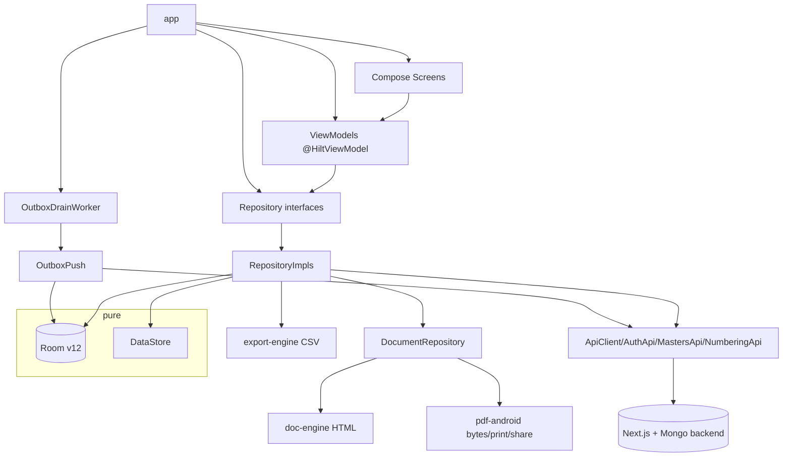
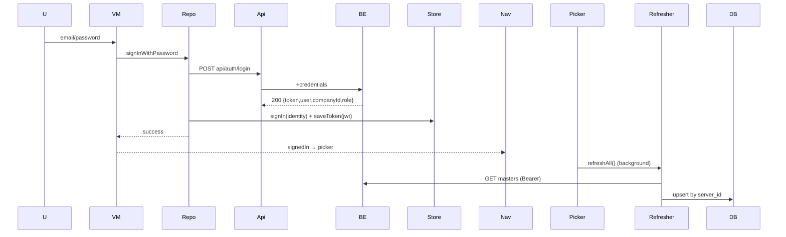
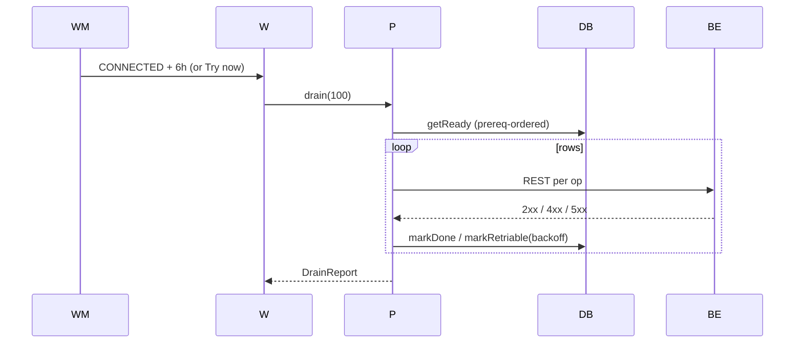
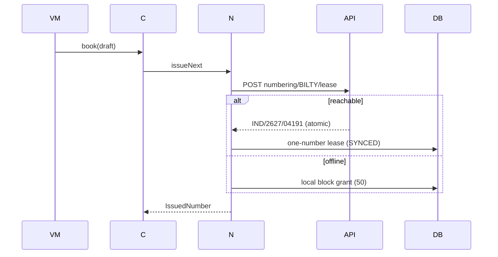

# Part 4 — App Flows, Sync Architecture, Feature Documentation

## 16–20 (continued from Part 3's flow seeds)

### 20.1 feature:auth (7 screens + legal)

**Screens:** T0 Splash, T1 Sign in, T2 Company/branch picker, T3 Setup wizard, T32
Carousel, T33 Profile, Legal doc. **VMs:** SplashVM, SignInVM, CompanyPickerVM,
SetupWizardVM, CarouselVM, ProfileVM. **Repos:** SessionRepository, CompanyRepository,
NumberingRepository (ensureSeries), MastersRefresher (S24 trigger). **DB:** COMPANY_E,
BRANCH_E, MEMBERSHIP_E, NUMBER_SERIES_E, outbox. **Flow:** resolver routes by session
state (D54); wizard persists company+branch+membership+series (one tx, prereq-ordered
outbox); picker selects active context and triggers background masters refresh.

### 20.2 feature:dashboard (T4)

VM runs ten parallel §13 queries + exceptions; hero money strip; role-gated tiles; taps
drill to T13/T12/T7/T8. **Repos:** DashboardRepository, StatusRepository, SessionRepository.

### 20.3 feature:booking (T5, T6)

The money screen. T5 = the single form (§3): parties (search), route/goods (pickers),
weight/volumetric, multi-article, charges (auto + manual), payment mode stamp, reserved
number, grand total, amend mode. T6 = 4-copy preview + print/share/save. **Repos:**
ConsignmentRepository (book/amend), NumberingRepository, RateCardRepository, MastersRepository,
DocumentRepository. **DB:** the full consignment aggregate + snapshot + outbox.

### 20.4 feature:consignment (T7, T8, T9)

T7 register (Paging 3 + filters + export). T8 case file (timeline, money, documents,
actions: print/share/amend/cancel/hold/raise-bill/photos). T9 status sheet (legal
continuations, hold rules, POD capture with signature+photo). **Repos:** RegisterRepository,
CaseFileRepository, StatusRepository, ConsignmentRepository, DocumentRepository, PhotoImporter.

### 20.5 feature:challan (T10, T11, T12)

T10 builder (pool + load meter + overload Manager gate), T11 detail (groups, money card
S19, print/share S22, add-cost), T12 board (filters, live route lines). **Repos:**
TripRepository, NumberingRepository, DocumentRepository.

### 20.6 feature:billing (T13–T16)

T13 unbilled pool (TBB grouped by party; build draft), T14 freight bill (draft → preview →
issue → print/share), T15 payments (To-Pay collect + Manager waiver; receipts + allocation),
T16 statement (FY ledger + Send PDF). **Repos:** BillingRepository, DocumentRepository.

### 20.7 feature:masters (T17–T20)

Hub with counts; generic list (search/chips/duplicates-merge); generic editor (draft-safe);
rate-card editor (resolution steps + editable rows + add-rate). **Repos:** MastersRepository,
SessionRepository.

### 20.8 feature:reports (T21–T23)

Hub grouped by question; viewer (freight register w/ totals); export centre (sheet picker →
CSV zip; XLSX/Tally honest-offline). **Repos:** ReportsRepository (+export-engine).

### 20.9 feature:settings (T24–T25, T26–T28, T31)

Hub (routes + identity), company profile (drafts + logo D60), branches (add dialog),
members (invites/cancel), numbering (counter change), account & data (facts, queue,
sync-now, debug long-press → screen map). **Repos:** SettingsRepository, AccountDataRepository,
SessionRepository, OutboxPush, MastersRefresher.

### 20.10 feature:templates (T29, T30)

Installed templates (filter, set default), template requests (queued-only §15).
**Repos:** TemplateRepository.

---

# Part 5 — Ops, Configuration, Security, Performance, Diagrams, AI Guide, Appendix

## 21. Global singletons

| Singleton | Owns |
|---|---|
| `TransportApp` (@HiltAndroidApp) | app-level init: seeder gate, WorkManager enqueue |
| `TransportDatabase` | the Room DB + 13 DAOs + migrations |
| `SessionStore` / `ActiveContextStore` | identity/JWT/session state; active company+branch |
| `SessionRepositoryImpl` | the only writer of session state |
| `OutboxWriter` | the only writer of outbox rows (inside caller transactions) |
| `ApiClient` / `AuthApi` / `MastersApi` / `NumberingApi` | the only network surface |
| `CurrentActivity` (pdf-android) | the resumed activity for PrintManager (D49) |
| `DeviceIdProvider` | lease device short-id |
| `HaulMotion` | motion specs (S20) |
| `TransportTypeScale/Colors/Shapes/Dimens` | design tokens |
| `DemoSeeder` | debug seed (FLAG_DEBUGGABLE) |
| `Routes` | every route constant |

## 22. Configuration

- **Versions/plugins:** see Part 1 §1.9–1.10 (catalog is the single source).
- **Manifest:** INTERNET permission (S23); FileProvider (pdfs/, pod/, exports/);
  `network_security_config` (release HTTPS-only; debug overlay cleartext for
  10.0.2.2/localhost); `dataExtractionRules`/`fullBackupContent` exclude app data (A5).
- **R8:** `isMinifyEnabled` + `isShrinkResources` with keep rules for Room generated
  classes, Hilt, kotlinx-serialization (companion/serializer patterns), OkHttp probes, the
  pdf-android JS bridge, and designsystem R classes.
- **Signing:** `key.properties` (gitignored) + external keystore
  `C:\Users\Lenovo\haulmate-keystore\haulmate-release.jks`; release signs with Haulmate key
  when present, debug otherwise (CI-safe).
- **applicationId:** `com.haulmate.transportapp` (final; D65). Namespace stays
  `com.example.transportapp` for now.

## 23. Resources

- `strings.xml`: only `app_name` — **i18n deliberately deferred** (user decision); all copy
  is Kotlin constants in UiStates (that IS the localisation strategy until extraction).
- Colors: `Color.kt` (two full schemes + sunrise + paper + stamps). **No colour outside
  Color.kt** in chrome (S20 audit).
- Typography: `Type.kt` (Anek/PlexSans/PlexMono via Google Fonts provider with fallback).
- Icons: material-icons-extended; rounded/outlined pairs for nav.
- Drawables: launcher icons (adaptive); route-line/stamp visuals are Canvas-drawn.
- Animations: `HaulMotion` specs (springs/tweens); no XML anims.
- Dimensions: `Dimens.kt` 4dp grid.

## 24. Security

- **Auth:** JWT (7 d TTL) from `POST /api/auth/login|dev-login`; stored in DataStore
  (plaintext — documented decision; SQLCipher/EncryptedPrefs deferred); attached by
  interceptor; 401 → AUTH_EXPIRED.
- **Authorization:** role rank checked **client-side for UI convenience** (RoleRank +
  VM gates) and **server-side** (backend `requireRole`) — RLS remains the production
  backend's job.
- **Token storage:** DataStore preferences (not EncryptedSharedPreferences — accepted
  risk documented; threat model = on-device transport data, not multi-user phones).
- **Backup:** cloud backup and device-transfer of app data disabled (A5); network config
  release = HTTPS-only.
- **Secrets:** none in git — keystore + key.properties are local/gitignored; backend JWT
  secret lives in `Backend/.env` (test only).
- **PII:** no Aadhaar/PAN ever (§17); location to nearest town only.

## 25. Performance

- **Startup:** debug seed is synchronous (by design); release skips it. Cold start
  3.3 s on emulator (budget 1.6 s — baseline profiles are the known fix, P6).
- **Register:** Paging 3 (page 30) + debounced LIKE search (150 ms) — benchmark exists
  (120 ms @ 5,000 parties); FTS tables exist but LIKE is used (D7).
- **Dashboard:** 10 parallel DAO queries on Dispatchers.IO, stamped "as of".
- **Recomposition:** stateless Content composables; derived values in UiState; S20 added
  springs — all reduced-motion-aware.
- **PDF:** headless WebView render off-main with retry (3×) through the byte path.
- **Images:** PhotoImporter downscales to ≤1600px, JPEG q80.
- **R8:** release shrinks 14.93 → 2.63 MB.

## 26. Complete dependency graph

## 27. Sequence diagrams (major workflows)

**Booking → print (offline)** — see Part 4 §16 "Book a bilty".

**Sign-in (online) → masters refresh:**

**Outbox drain:**

**Number lease (online vs offline):**

## 28. File cross-references (high-value files)

| File | Used by | Depends on | Reads/Writes |
|---|---|---|---|
| `Routes.kt` | every NavGraph + screen | — | — |
| `AppNavDrawer.kt` | T4/T7/T12 | designsystem | — |
| `ApiClient.kt` | AuthApi/MastersApi/NumberingApi | OkHttp, TokenProvider | HTTP |
| `SessionStore.kt` | SessionRepositoryImpl, TokenProvider | DataStore | identity/JWT/context |
| `OutboxWriter.kt` | every write repo | OutboxDao | outbox rows |
| `OutboxPush.kt` | OutboxDrainWorker, T31 | ApiClient, DB, Session | outbox + PARTY_E + HTTP |
| `MastersRefresher.kt` | CompanyPickerVM, T31 | MastersApi, DB, Session | PARTY_E/STATION_E |
| `DocumentRepository.kt` | T6/T8/T11/T14/T16 | TemplateDao/TripDao/BillingDao, PdfPort/Actions, OperationalDocuments | files + HTTP-free renders |
| `PhotoImporter.kt` | T8 attachments, T9 POD, T25 logo | ContentResolver | files/{attachments,pod,logos} |
| `DemoSeeder.kt` | TransportApp (debug) | DAOs | full seed dataset |
| `ErrorCopy.kt` | every error surface | ErrorCode | — |
| `HaulMotion.kt` | S20 animations | — | — |

## 29. AI Developer Guide

**Start here, in order:**
1. `TransportApp2/Spec.md` (the operating manual — 244 lines).
2. `AgentChanges.md` (decisions D1–D65; read the D-numbers for your area).
3. This report's Part 1 (map) and Part 3 §9 (repositories — the real API surface).
4. One exemplar of each pattern: `RegisterViewModel` (paging+filters),
   `BookingFormViewModel` (largest form), `ChallanDetailViewModel` (renders+costs),
   `OutboxPush` (sync), `OperationalDocuments` (doc templates).

**Coding style (enforced by review/CI):** MVVM-UDF shapes per Spec §3; UiState-complete;
events-only input; one-shot effects as StateFlow; repos return `Result` with typed codes;
paise/grams Long; no Double on money/weight; validation before write; every write in one
transaction with its outbox row; tombstones, never hard-deletes; entities never leave the
data layer.

**Safe places to modify:** a feature's UiState/Content (UI-only), a ViewModel's event
handling, adding a new composable to `:core:designsystem`, adding a new DAO query,
adding a new outbox entity family (follow OutboxPush's PARTY pattern).

**Dangerous areas:**
- `status_projection` — only `StatusRepository.rebuildProjection` may write it.
- Numbering — never consume a number outside `issueNext`'s lease path; never rewind
  `last_issued` (counter change is forward-only, §9).
- Migrations — never edit exported schemas; bump version + add migration + test.
- `SessionStore` state machine — the three-state order (D54) is subtle; test with the
  fakes.
- The bilty golden file — regenerate with `-Pgolden.update=true`, never hand-edit.
- PowerShell file writes (encoding rule — see AGENTS.md).

**Common pitfalls (learned the hard way, see AgentChanges "Mistakes"):**
- Kotlin `$state.field` string templates stringify the whole object — use `${state.field}`.
- `Modifier.graphicsLayer` moved to `androidx.compose.ui.graphics` (not `ui.draw`) in this
  BOM.
- SessionStore's three-state machine: preserve `destination` across step updates with
  `copy`, never replace the whole state.
- Fake test repos must implement every new interface member (patch all 11 fakes when
  SessionRepository changes).
- adb cannot reliably type into Compose fields or long-press — verify via Compose tests.

**Extension points:**
- New screen: Routes → feature graph → Screen/Content/UiState/VM → wire callbacks.
- New document: add a builder in `OperationalDocuments` + `DocumentRepository.renderX` +
  wire the screen (follow renderChallan).
- New sync family: follow `OutboxPush.pushParty` (INSERT/UPDATE/DELETE + server-id
  writeback) and add the mapping to `pushOne`.
- New report: ReportsDao query → ReportsRepository → ReportsHub entry.

**Testing strategy:** JVM tests per layer — VM reducer tests (fakes + fake clock), repo
tests (in-memory Room + DemoSeeder), Robolectric Compose tests for state/UI contracts,
MockWebServer for the network boundary, migration tests per bump. Naming
`given_when_then`. DoD per Spec §13.

**Recommended workflow:** read Spec.md → check the D-numbers for your area → implement →
`compileDebugKotlin` → `test` → `checkPureModules` → `installDebug` demo walk →
`AgentChanges.md` entry + new D-number → graphify update.

## 30. Appendix

### Glossary
Bilty/consignment note (GR/LR) · Challan (loading challan) · Party (customer) ·
To Pay/TBB/Paid (payment modes) · Hamali (loading charge) · bhada (lorry hire) ·
TBB (to be billed) · POD (proof of delivery) · GTA (goods transport agency) ·
paise (₹1 = 100 paise) · FY (Indian financial year, Apr–Mar).

### Architecture summary
25 Gradle modules; MVVM-UDF; Room-as-truth + outbox; pure JVM domain/engines/network;
Hilt DI; Compose M3 with a custom token system; offline-first with a mirroring backend.

### Feature summary
auth (6 screens + legal) · dashboard · booking (2) · consignment (3) · challan (3) ·
billing (4) · masters (4) · reports (3) · settings (7) · templates (2) — 34 screens.

### State summary
Every screen: `UiState` (loading/error always) + one-shot effect flows; session is a
3-state DataStore machine (D54); consignment status is a derived projection over an
append-only log.

### Repository summary
17 repositories + 2 sync helpers (MastersRefresher, OutboxPush); all writes transactional
with outbox; typed `Result` errors.

### Navigation summary
Splash → (sign-in) → picker → dashboard; 3 bottom-nav roots with drawer; every other
screen pushes; tab semantics = popUpTo(0)+saveState+restoreState.

### ViewModel summary
30 @HiltViewModels; `StateFlow<UiState>` + one-shot effect flows; SavedStateHandle for
args + drafts.

### Database summary
Room v12, 33 entities + 2 FTS + outbox/cursor/seed, 13 DAOs, 12 migrations.

### API summary
Next.js + Mongo test backend: auth, org, 9 masters CRUD, consignments (+cancel/status/pod),
trips (+dispatch/close/costs), billing (unbilled/bills/issue/receipts/allocate), numbering
(lease/next), health.

### Known TODOs (deliberate, tracked)
- Full §16.2 replay/conflict sync (needs production backend endpoints)
- Credential Manager / real Google auth (needs backend OAuth)
- Consignment/trip/billing outbox families (mapping sprint)
- Receipt print (render exists; needs receipt id surfaced from save flow)
- Statement period control (FY fixed today)
- i18n extraction (user-excluded for now)
- Baseline profiles + Macrobenchmark (cold start 3.3 s vs 1.6 s budget)
- Routes/goods/vehicles/drivers in the masters refresher (pattern exists)
- Register→case-file shared-element hero (nav-compose placement)

### Known technical debt
- Dotted feature source directories (cosmetic)
- `core/ui/sample/` residual row types (used by unmigrated screens)
- Debug `Log` calls in pdf-android (stripped by R8 in release)
- ChallanBuilder vehicle/driver auto-pick = first-available (picker deferred)
- Turmeric accent overloading (design decision B8 open)

### Known bugs
- None open at ship state; cold start 3.3 s exceeds the 1.6 s budget (documented, tooling
  planned).

### Improvement suggestions
1. Deploy backend (Atlas + hosting) → unlock delta sync + multi-device.
2. Real auth UI (repo path exists) → replace mock identity completely.
3. Compose shared-element hero register→case file.
4. Thermal 2/3-inch ESC-POS printing (Indian field value).
5. Baseline profiles + Macrobenchmark module.

---

## 21. Globals (singletons)

TransportApp (Hilt root + seeder gate + WorkManager enqueue); TransportDatabase (Room v12); SessionStore/ActiveContextStore (DataStore identity/context/JWT); SessionRepositoryImpl; OutboxWriter (only outbox writer); ApiClient/AuthApi/MastersApi/NumberingApi (HTTP); MastersRefresher (pull); OutboxPush (push); CurrentActivity registry (print); DeviceIdProvider (lease ids); HaulMotion (motion specs); TransportTypeScale/Colors/Shapes/Dimens (tokens); Routes (route constants); ErrorCopy (error copy); DemoSeeder (debug seed); SeedIds (seed constants).

## 22. Configuration

app/build.gradle.kts: applicationId com.haulmate.transportapp, minSdk 24, target/compile 37, versionCode 1/1.0; signing via key.properties (gitignored, forward-slash storeFile); release = minify+shrinkResources+proguard-rules.pro; debug overlay manifest adds cleartext for 10.0.2.2/localhost; INTERNET permission; FileProvider paths (pdfs/pod/exports); network_security_config (release HTTPS-only). gradle/libs.versions.toml is the only version source. Configuration cache ON; checkPureModules guard in root build.gradle.kts.

## 23. Resources

strings.xml has only app_name (i18n deferred, user decision) - all copy is Kotlin constants in UiStates (that IS the localisation strategy until extraction). Colors: Color.kt two full schemes (Day Shift/Night Haul) + sunrise + shadowTint + PaperColors (never inverts). Type: Anek/PlexSans/PlexMono via Google Fonts + displayHeroMoney. Icons: material-icons-extended. Dimensions: Dimens.kt 4dp grid + row ladder. Animations: HaulMotion springs/tweens (no XML anims). Drawables: launcher only; route lines/stamps are Canvas.

## 24. Security

JWT (7d) in DataStore (plaintext - documented risk), attached by OkHttp interceptor; role gates client-side (RoleRank) + server-side (rbac.requireRole); backup/extraction exclude app data; release network config HTTPS-only; secrets: keystore outside repo, key.properties gitignored (test backend JWT secret in Backend/.env); no Aadhaar/PAN ever; tenant scoping companyId+branchId everywhere; RLS is the production backend's job.

## 25. Performance

Paging 3 register (page 30) + debounced LIKE search (120ms budget tested at 5k parties); 10 parallel dashboard DAO queries; PdfRenderer off-main with retry; PhotoImporter downscales to 1600px/JPEG80; R8 14.93->2.63 MB; cold start 3.3s on emulator (budget 1.6s - baseline profiles are the known fix); springs are reduced-motion-aware.

## 26. Complete dependency graph (per feature)

Screen -> VM -> Repo interface -> Impl -> (Room DAOs | DataStore | ApiClient | engines) -> (SQLite | DataStore | Backend). Engines: doc-engine (HTML) -> pdf-android (PDF). See PART1 1.4 for the module graph.

## 27. Sequence diagrams (major workflows)

Launch (fresh release): icon -> Splash 4-step -> signed-out -> T1 -> mock signIn (D62) -> T2 picker (empty) -> T3 wizard -> company+branch+series -> T4 dashboard.
Booking: T5 fill -> per-keystroke recompute -> Book and print -> lease (server-first, fallback local) -> transaction (consignment+items+charges+event+snapshot+outbox) -> T6 render 4 copies -> print/share.
Delivery: T8 -> T9 hold/arrive/out-for-delivery/delivered (POD gate: signature + optional photo) -> projection advances.
Billing: T13 pool -> build -> T14 issue (server number) -> T15 collect/allocate -> T16 statement PDF.
Sync: WorkManager 6h/CONNECTED or T31 Try now -> OutboxPush.drain (PARTY ops, DONE/retriable) -> MastersRefresher.refreshAll (upsert by server_id) -> T31 queue re-read.

## 28-30. See the per-file rows in PART2 3.x, the repo/VM tables in PART3, and the checklist-driven AI guide below.

## 29. AI Developer Guide

Start: Spec.md -> AgentChanges.md (D-numbers for your area) -> PART1 map + PART3 9 (repos) -> exemplars: RegisterViewModel (paging+filters), BookingFormViewModel (largest form), ChallanDetailViewModel (renders+costs), OutboxPush (sync), OperationalDocuments (doc templates).
Style: MVVM-UDF (Spec 3); UiState-complete; events-only; one-shot effects as StateFlow; repos return Result with typed codes; paise/grams Long; validation before write; one transaction per write with outbox; tombstones never hard-delete; entities never leave the data layer.
Pitfalls: PowerShell writes corrupt UTF-8 (use file tools/.NET UTF8 no-BOM); state.field templates stringify the whole object (use {state.field}); graphicsLayer import moved to androidx.compose.ui.graphics; SessionStore 3-state order (copy, never replace, per step); fake test repos must implement every new interface member; adb cannot type into Compose/long-press (test via Compose tests).
Dangerous: status_projection (only StatusRepository writes), numbering (never consume outside issueNext, never rewind last_issued), migrations (never edit exported schemas), bilty golden file (regenerate with -Pgolden.update=true), keystore (back it up).
Extension points: new screen (Routes -> graph -> Screen/Content/UiState/VM); new document (OperationalDocuments builder + renderX + wire); new sync family (OutboxPush.pushOne mapping); new report (ReportsDao -> ReportsRepository -> hub entry).
Workflow: implement -> compileDebugKotlin -> test -> checkPureModules -> installDebug demo walk -> AgentChanges entry + D-number -> graphify update.

## 30. Appendix

Glossary: Bilty = consignment note (GR/LR); Challan = loading challan; Party = customer; TBB = to be billed; POD = proof of delivery; Hamali = loading charge; bhada = lorry hire; GTA = goods transport agency; paise = 1/100 rupee; FY = Indian financial year (Apr-Mar).
Known TODOs: delta-sync replay + idempotency (needs production backend), Credential Manager auth, consignment/trip/billing outbox families, receipt print id surfacing, statement period control, i18n, baseline profiles, routes/goods/vehicles/drivers refresher, register-case-file hero.
Known debt: dotted feature source dirs; core/ui/sample residual types; debug Log in pdf-android (R8-stripped); challan vehicle/driver auto-pick; turmeric accent overload (B8); cold start 3.3s vs 1.6s budget.
Known bugs: none open at ship state.